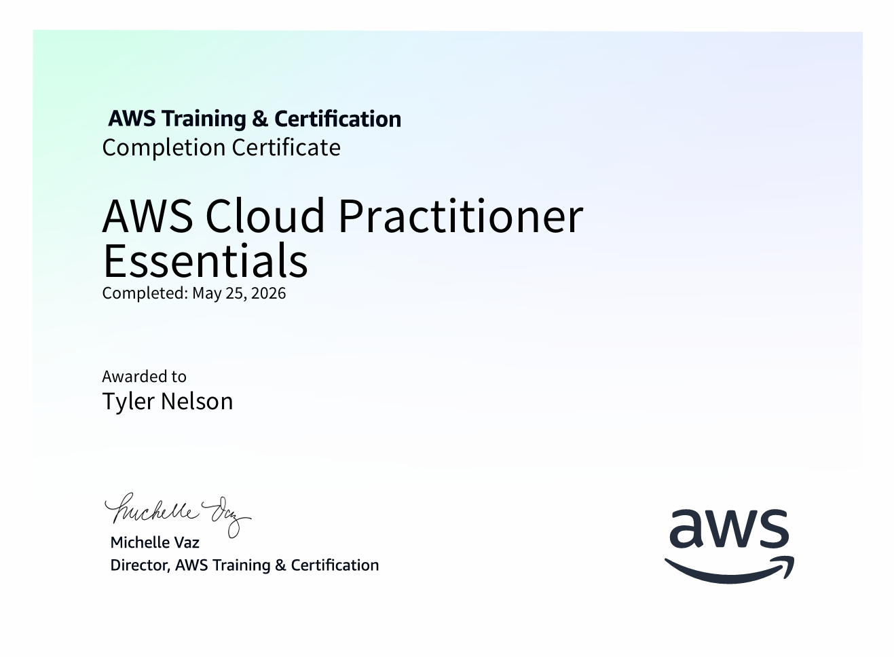

# Cloud Engineer Journey

**Self-Taught AWS Cloud Practitioner | Transitioning into Cloud Technology**

Hi, I'm Tyler Nelson. I'm on a dedicated journey to build a career in AWS cloud engineering through consistent daily learning and hands-on practice.

This repository documents my daily progress as I work toward the **AWS Certified Cloud Practitioner** certification and beyond.

### Current Status
- ✅ **Completed**: AWS Cloud Practitioner Essentials (full course + labs) – May 25, 2026

### What You'll Find Here
- **notes/** → Daily learning logs with screenshots and key takeaways
- **images/** → All lab screenshots and progress visuals
- **certificates/** → Official completion certificates

### Next Steps
- Pass the **AWS Certified Cloud Practitioner** exam
- Begin the Solutions Architect Associate track
- Build larger portfolio projects (Cloud Resume Challenge and more)
