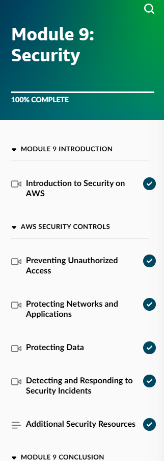
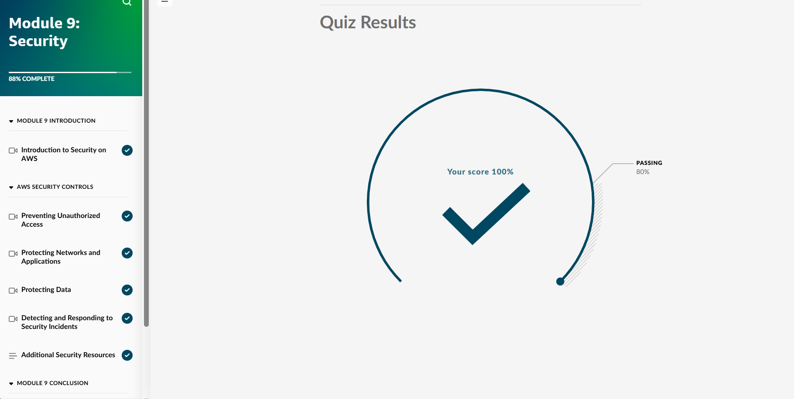
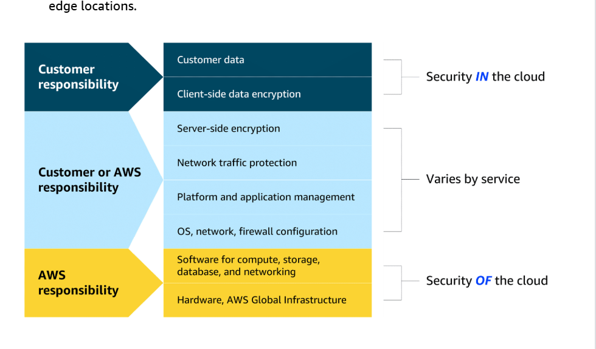
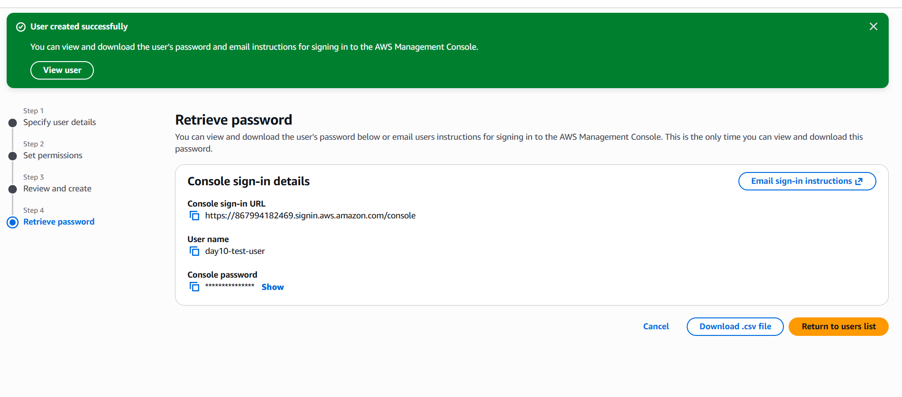
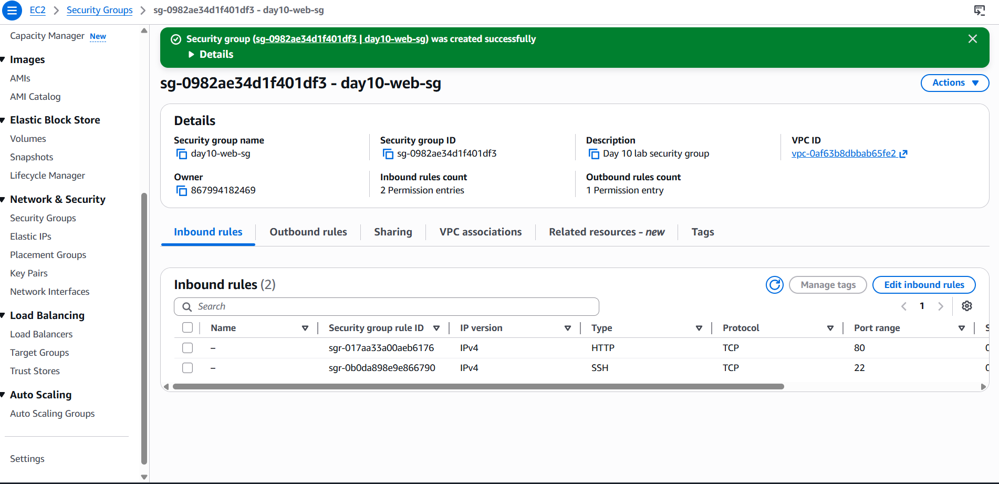
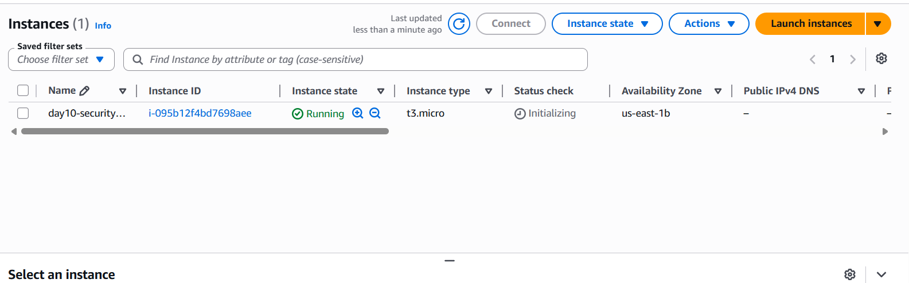
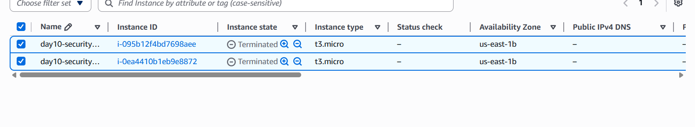
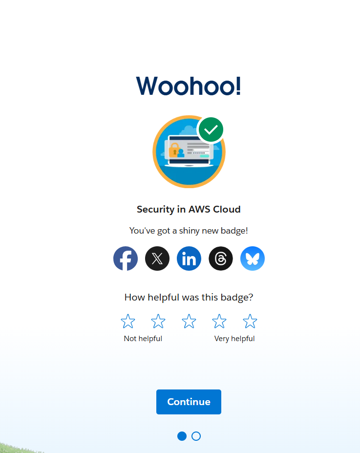

## Day 10 – Module 9: Security (May 21, 2026)

**Focus:** Core AWS Security principles, Shared Responsibility Model, IAM, and Security Groups — one of the highest-yield modules for the Cloud Practitioner exam and real-world cloud work.

**Skill Builder Progress:**
- Module 9: Security → **100% Complete**
- Final Quiz Score: **100%**

**Key Topics Learned (Detailed):**

- **AWS Shared Responsibility Model** (Most Critical Concept)
  - AWS is responsible for **Security OF the Cloud** (physical hardware, global infrastructure, data centers, hypervisor).
  - Customer is responsible for **Security IN the cloud** (customer data, applications, OS patching, IAM policies, encryption, network configuration, etc.).
  - Responsibility varies by service (more customer responsibility with EC2, less with S3/Lambda).

- **Root User vs IAM Users**
  - Root user has unlimited access (including billing) and should almost never be used for daily tasks.
  - Best practice: Use IAM users/roles with least privilege.

- **IAM (Identity and Access Management)**
  - Users, Groups, Roles, Policies, MFA
  - Importance of MFA (Virtual MFA apps + Hardware keys like YubiKey using U2F/FIDO2)

- **Network Security**
  - Security Groups (stateful, instance-level firewall)
  - Network ACLs (stateless, subnet-level)
  - Inbound vs Outbound rules

- **Other Security Services**
  - AWS Shield & WAF (DDoS and web protection)
  - GuardDuty (threat detection)
  - Inspector (vulnerability scanning)
  - Encryption options (KMS, S3 SSE, etc.)

**Hands-On Lab:**
- Created IAM user with AdministratorAccess policy
- Built custom Security Group allowing HTTP (port 80) and SSH (port 22)
- Launched EC2 instance attached to the new Security Group
- Practiced full resource cleanup (EC2 → Security Group → IAM User) to stay in Free Tier
- Handled connectivity troubleshooting (public IP / route table issues)

**Trailhead Progress:**
- Completed “Security in AWS Cloud” modules
- Earned Security in AWS Cloud badge

**Screenshots:**
  
  
  
  
  
  
  

**Takeaways:**
- Security is not optional — it is foundational to every cloud role. Misunderstanding the Shared Responsibility Model is one of the most common causes of security incidents.
- Proper IAM and Security Group configuration are daily tasks for cloud engineers and support roles.
- Always follow least privilege and enable MFA, especially on high-privilege accounts.
- Cleaning up resources after every lab is a professional habit that saves money and shows discipline.

**Next:** Day 11 – Module 10: Monitoring, Compliance and Governance in the AWS Cloud

**Current Goal:** AWS Cloud Practitioner certification by mid-June 2026
