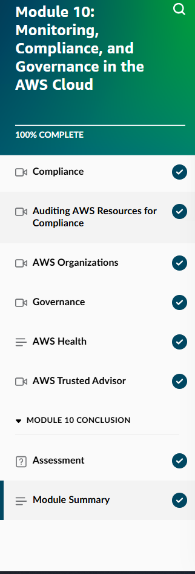
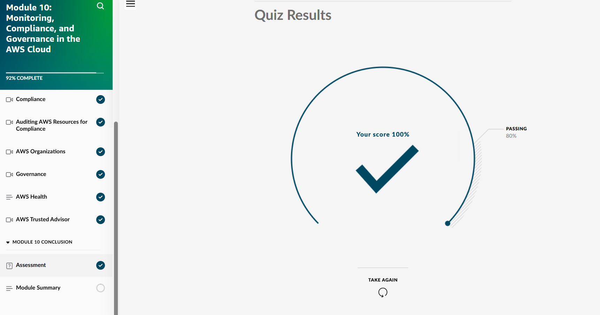
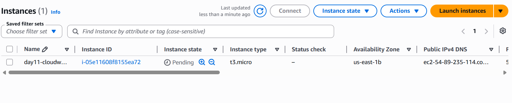
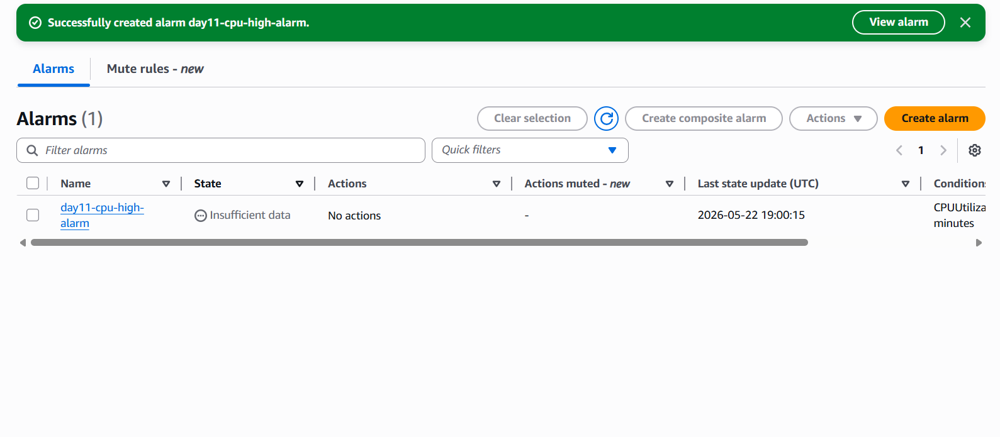
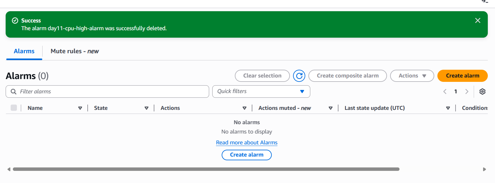
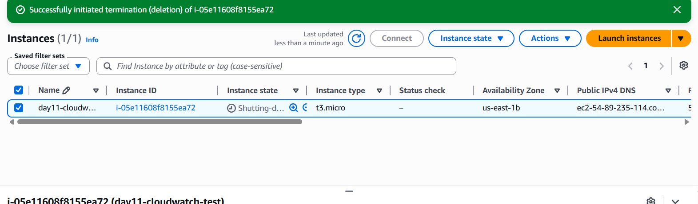

## Day 11 – Module 10: Monitoring, Compliance, and Governance in the AWS Cloud (May 22, 2026)

**Focus:** Monitoring, logging, compliance, and governance services — essential knowledge for real-world cloud operations and job readiness.

**Skill Builder Progress:**
- Module 10: Monitoring, Compliance, and Governance → **100% Complete**
- Final Quiz Score: **100%**

**Key Topics Learned (Detailed):**

- **Amazon CloudWatch** — Core monitoring service
  - Metrics collection (CPU, memory, network, custom metrics)
  - Alarms for proactive notifications
  - Dashboards and Logs
- **AWS CloudTrail** — API activity logging and auditing
- **AWS Config** — Resource configuration tracking and compliance monitoring
- **AWS Organizations** — Centralized account management and consolidated billing
- **Service Control Policies (SCPs)** — Enforcing governance rules across accounts
- **AWS Trusted Advisor** — Best practice recommendations for cost, security, and performance
- **AWS Artifact & Compliance Center** — Compliance reports, customer stories, and checklists

**Hands-On Lab:**
- Launched an EC2 instance
- Created a CloudWatch alarm monitoring CPUUtilization with a 60% threshold
- Practiced full resource cleanup (EC2 instance + Alarm)

**Screenshots:**
  
  
  
  
  

**Takeaways:**
- CloudWatch is one of the most frequently used services in daily cloud operations for monitoring and alerting.
- Understanding the relationships between CloudWatch, CloudTrail, and Config is key for effective governance and troubleshooting.
- Proper cleanup after every lab demonstrates responsibility and cost awareness — important professional habits.
- Governance tools like AWS Organizations and SCPs become critical as environments grow.

**Next:** Day 12 – Module 11: Pricing and Support

**Current Goal:** AWS Cloud Practitioner certification by mid-June 2026
