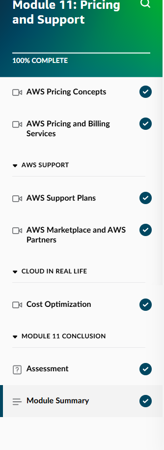
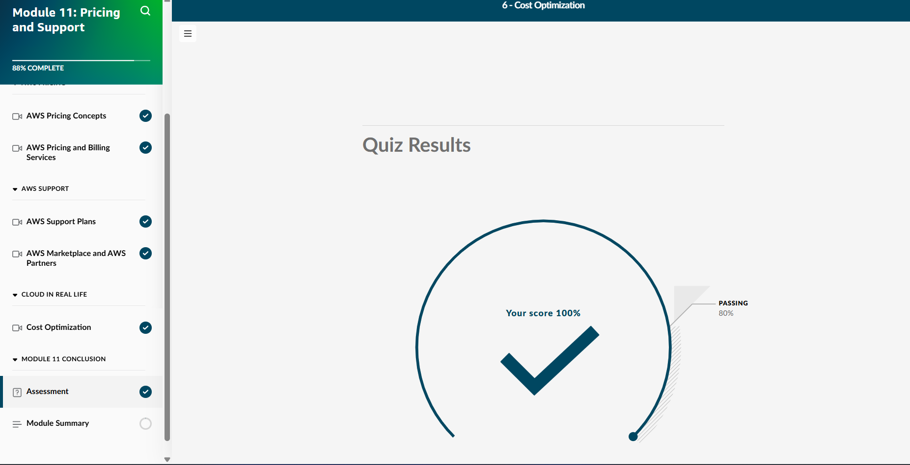
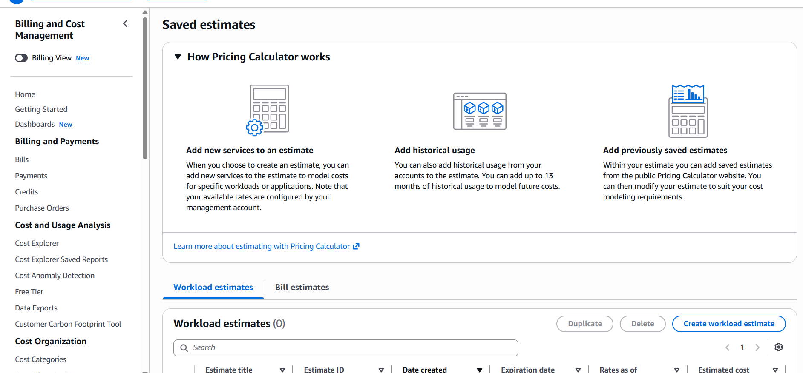
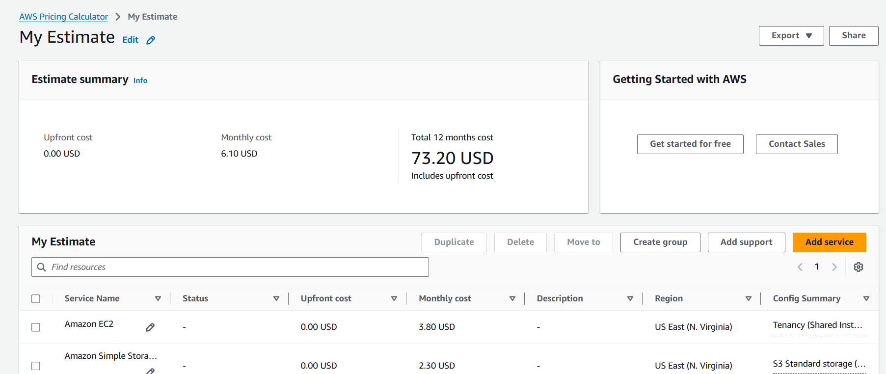
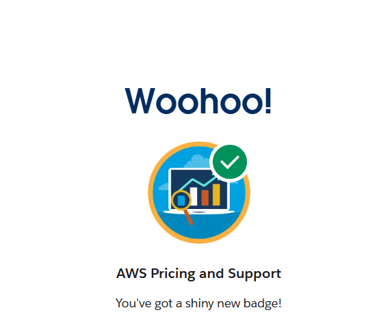
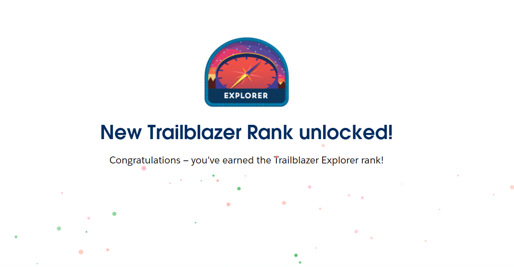

## Day 12 – Module 11: Pricing and Support (May 23, 2026)

**Focus:** AWS Pricing models, cost management tools, and support options — essential knowledge for cost optimization and customer-facing cloud roles.

**Skill Builder Progress:**
- Module 11: Pricing and Support → **100% Complete**
- Final Quiz Score: **100%**

**Key Topics Learned:**
- AWS Pricing Philosophy: Pay as you go, Pay less by using more, Save when you commit
- Pricing Models: On-Demand, Reserved Instances, Savings Plans, Spot Instances
- AWS Pricing Calculator for building accurate cost estimates
- Cost Explorer, Budgets, and Billing tools
- AWS Support Plans (Basic, Developer, Business, Enterprise)
- AWS Marketplace and Total Cost of Ownership (TCO) concepts

**Hands-On Lab:**
- Used the AWS Pricing Calculator to create a realistic monthly estimate
- Added EC2 (t3.micro) and Amazon S3 Standard storage
- Reviewed 12-month cost projection for a simple workload

**Trailhead Progress:**
- Completed AWS Pricing and Support modules
- Earned “AWS Pricing and Support” badge
- Unlocked new **Trailblazer Explorer** rank

**Screenshots:**
  
  
  
  
  

**Takeaways:**
- Understanding pricing and cost optimization is a highly valued skill in cloud roles.
- The Pricing Calculator is a practical tool for estimating real-world workloads.
- Different support plans provide varying levels of assistance — important when advising customers.
- Consistent daily progress (including extra Trailhead) builds strong momentum toward certification.

**Next:** Day 13 – Module 12: Migrating to the AWS Cloud

**Current Goal:** AWS Cloud Practitioner certification by mid-June 2026
