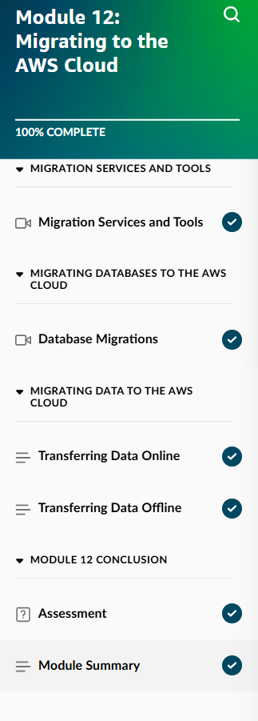
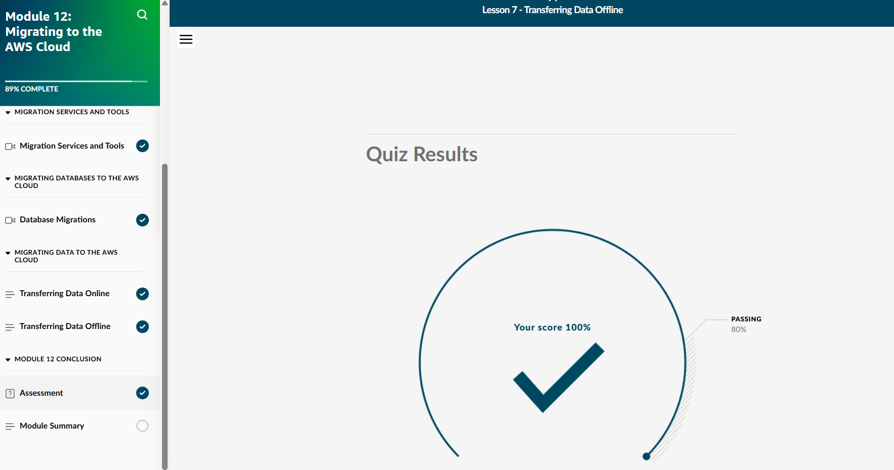
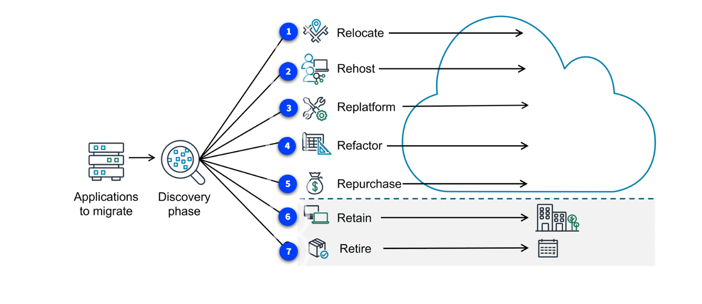
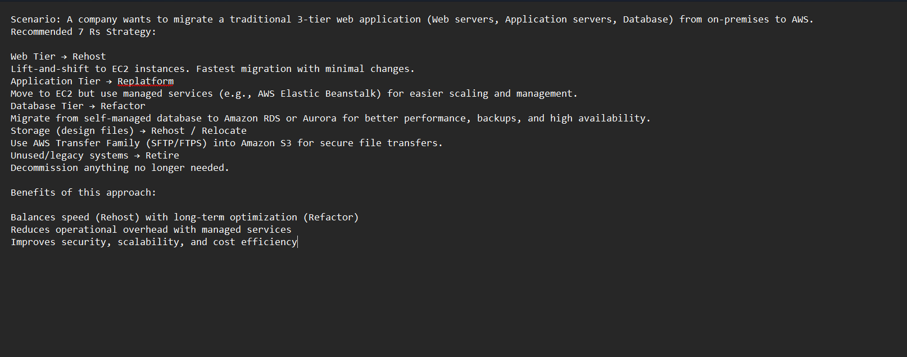
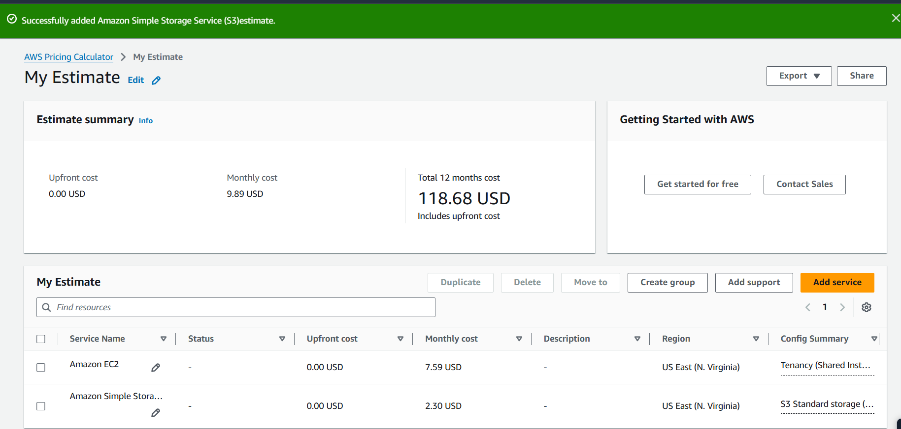

## Day 13 – Module 12: Migrating to the AWS Cloud (May 24, 2026)

**Focus:** Migration strategies, tools, and best practices for moving workloads from on-premises to AWS.

**Skill Builder Progress:**
- Module 12: Migrating to the AWS Cloud → **100% Complete**
- Final Quiz Score: **100%**

**Key Topics Learned:**
- The **7 Rs** of Migration (current AWS framework):
  - Rehost, Relocate, Replatform, Refactor, Repurchase, Retire, Retain
- Migration assessment, planning, and execution phases
- AWS migration services and tools
- Data transfer options (online vs offline)
- Total Cost of Ownership (TCO) analysis

**Hands-On Lab:**
- Reviewed the 7 Rs framework in detail
- Created a practical migration plan for a 3-tier web application
- Built a sample cost estimate using the AWS Pricing Calculator

**Migration Plan Example (3-Tier Web Application):**
- **Web Tier** → Rehost (lift-and-shift to EC2)
- **Application Tier** → Replatform (EC2 + managed services like Elastic Beanstalk)
- **Database Tier** → Refactor (migrate to Amazon RDS or Aurora)
- **Storage (design files)** → Rehost / Relocate using AWS Transfer Family into S3
- **Unused/legacy systems** → Retire

**Screenshots:**
  
  
  
  

**Takeaways:**
- Choosing the right migration strategy for each workload is critical for balancing speed, risk, and long-term value.
- Strong planning and cost analysis are essential for successful cloud migrations.

**Next:** Day 14 – Module 13: Well-Architected Solutions

**Current Goal:** AWS Cloud Practitioner certification by mid-June 2026
