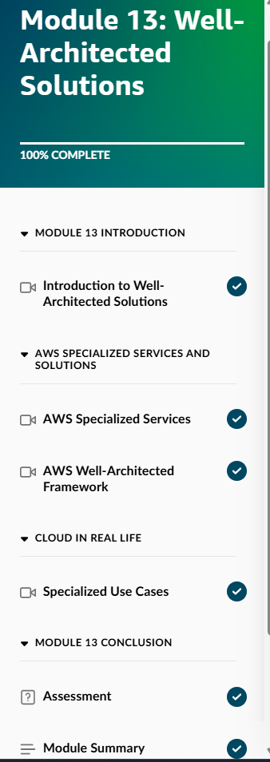
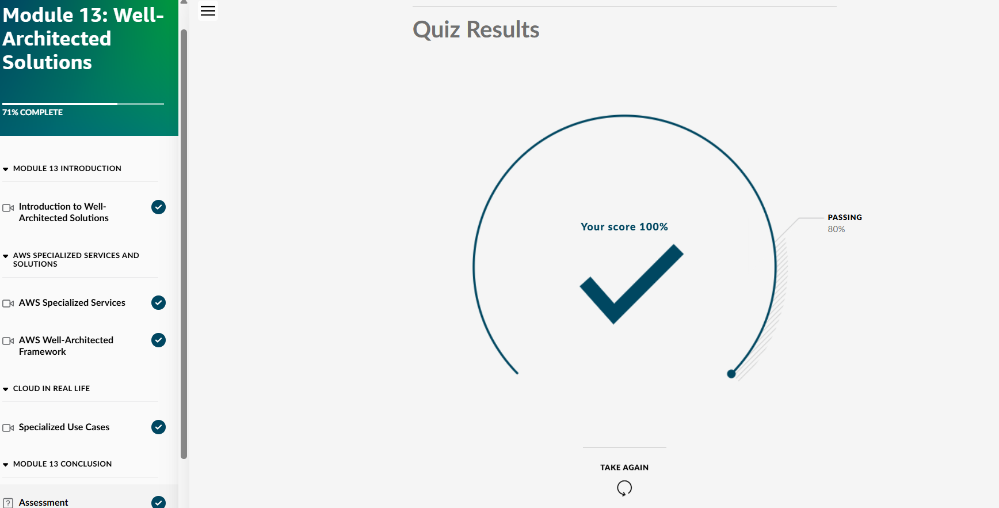
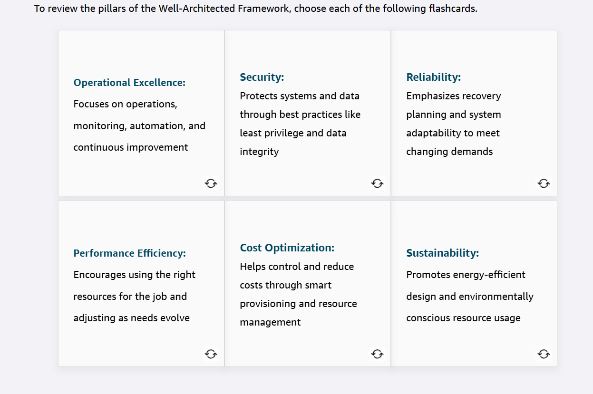
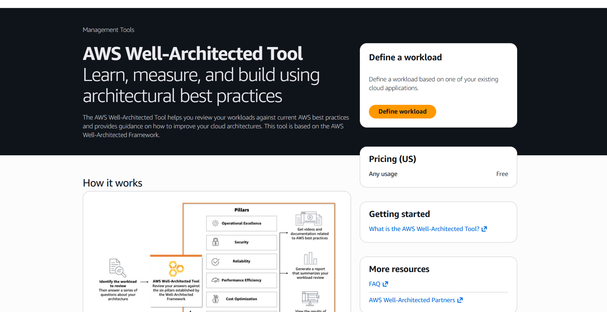
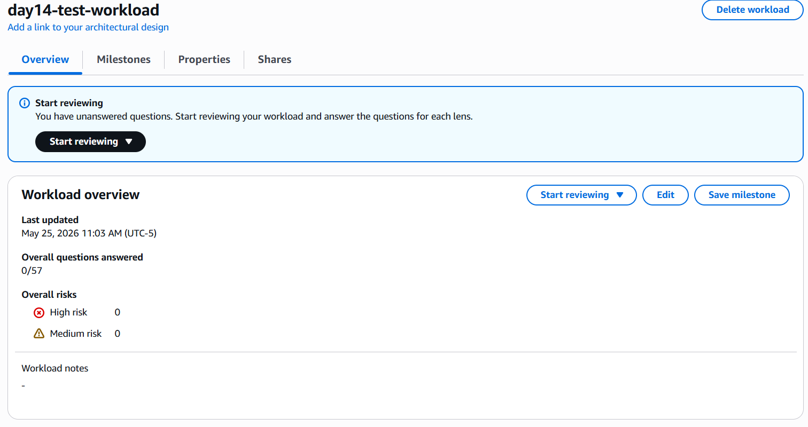
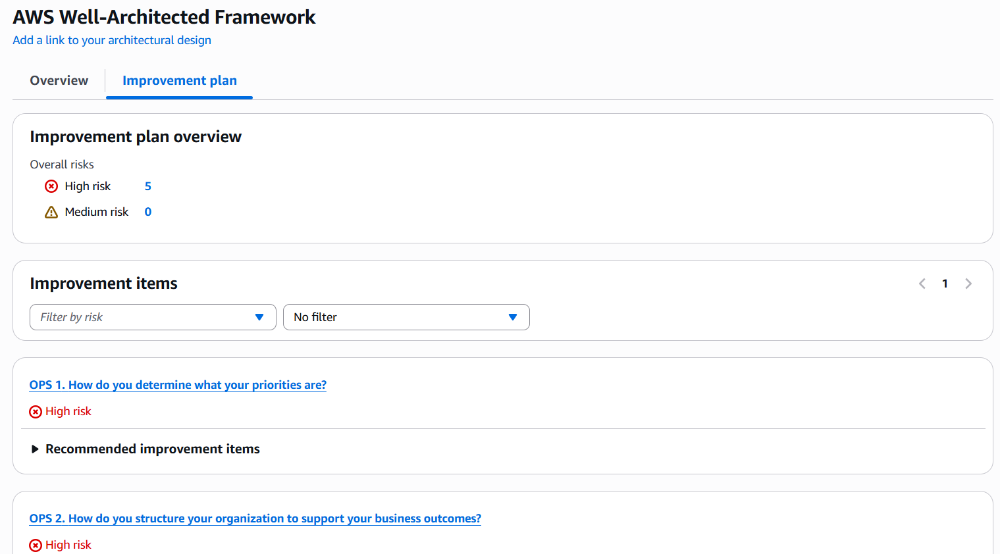

## Day 14 – Module 13: Well-Architected Solutions (May 25, 2026)

**Focus:** AWS Well-Architected Framework — the final module of the AWS Cloud Practitioner Essentials course.

**Skill Builder Progress:**
- Module 13: Well-Architected Solutions → **100% Complete**
- Final Quiz Score: **100%**

**Key Topics Learned:**
- The AWS Well-Architected Framework and its **6 Pillars**:
  - Operational Excellence
  - Security
  - Reliability
  - Performance Efficiency
  - Cost Optimization
  - Sustainability
- How to review workloads against best practices
- Identifying risks and improvement opportunities
- Using the AWS Well-Architected Tool

**Hands-On Lab:**
- Created a workload in the Well-Architected Tool
- Performed a partial review and reviewed the improvement plan

**Screenshots:**
  
  
  
  
  

**Takeaways:**
- The Well-Architected Framework is a foundational tool used by cloud architects and engineers to design and review systems.
- Evaluating workloads against the 6 pillars helps identify risks early and drive continuous improvement.
- This framework is frequently referenced in interviews and real-world architecture discussions.

**Next Phase:** Review + AWS Cloud Practitioner certification exam

**Current Goal:** Pass the AWS Cloud Practitioner certification by mid-June 2026
