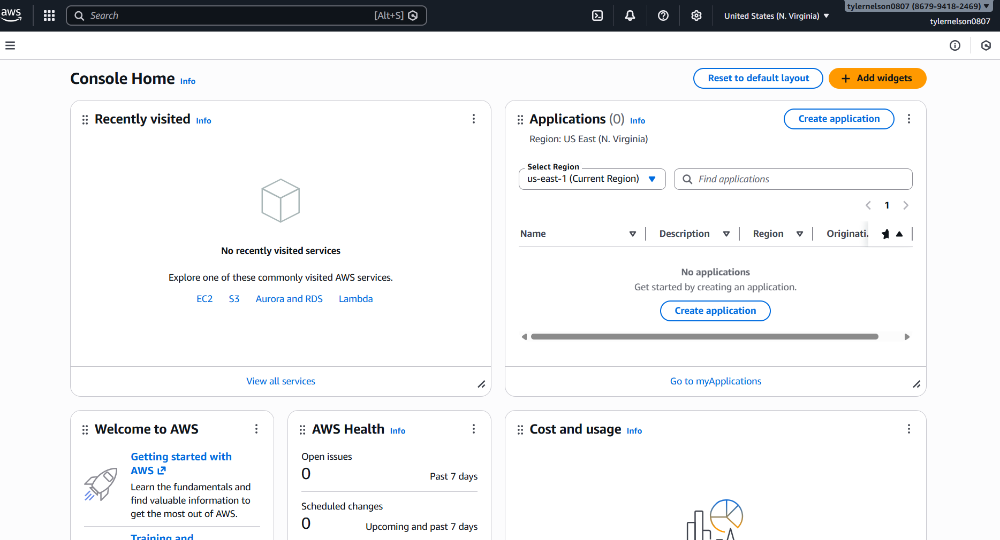

## Day 1 – Setup & Foundation (January 13, 2026)

**Goal:** Create all accounts, verify access, and prepare for learning

**What I Completed:**
- AWS Skill Builder account created + enrolled in Cloud Practitioner Essentials (Digital)
- AWS Free Tier account created (region: US East (N. Virginia) us-east-1)
- GitHub repo "cloud-engineer-journey" created with images/ and notes/ folders
- LinkedIn profile updated with new headline, About section, and repo link

**Screenshots:**
  
  

**Takeaways:**
- Setup took longer than expected due to region confusion, but everything works now
- US East (N. Virginia) is the best region — full Free Tier access and most tutorials use it
- Ready to start actual modules tomorrow

**Next:** Day 2 – Start Module 1 Lesson 1 "Introduction to the Cloud" in Skill Builder
