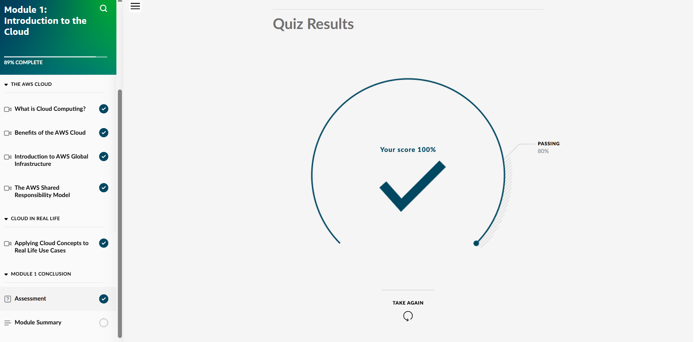

## Day 2 – Module 1: Introduction to the Cloud (January 14, 2026)

**Goal:** Understand what cloud computing is and how AWS fits in

**What I Completed:**
- Finished AWS Skill Builder Module 1: Introduction to the Cloud
- Watched videos on cloud basics, benefits, global infrastructure, shared responsibility model
- Passed final quiz with 100% score
- Explored AWS regions in console
- Completed Trailhead "Get to Know Cloud Computing with AWS"

**Screenshots:**
  
  
  

**Takeaways:**
- Cloud computing = on-demand delivery of IT resources over the internet (pay as you go)
- AWS Shared Responsibility Model: AWS handles security OF the cloud, customer handles security IN the cloud
- Regions & Availability Zones = key for low latency and high availability
- Excited to dive into compute/storage next

**Next:** Day 3 – Start Module 2 (Compute in the AWS Cloud)
