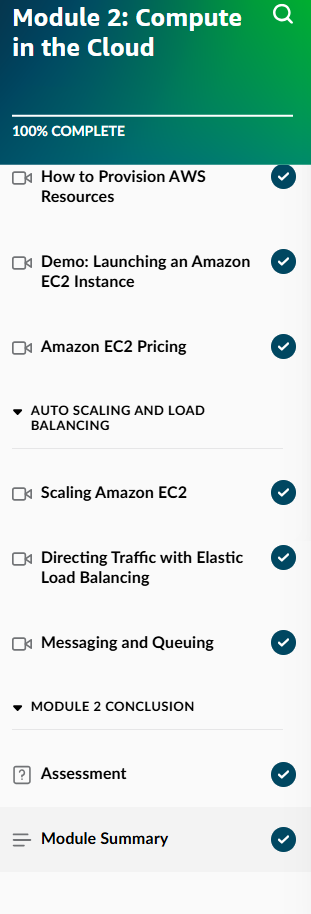

## Day 3 – Compute in the Cloud: Module 2 Completion (January 15, 2026)

**Goal:** Deepen cloud foundations + master compute concepts (EC2 basics & related services)

**Skill Builder Progress (Overall Course Order):**
- Module 1: Introduction to the Cloud → Completed  
- Module 2: Compute in the Cloud → Completed (100%)  
- Next up: Module 3 - Exploring Compute Services (just starting)

**What I Completed in Module 2: Compute in the Cloud**
This module was packed! I learned a ton about how AWS compute works in practice.

- **How to Provision AWS Resources** — Using the AWS Management Console, CLI, and SDKs to create and manage resources  
- **Launching an Amazon EC2 Instance** — Step-by-step demo: choosing AMI (Amazon Linux), instance type, key pair, security groups, and launching  
- **EC2 Instance Types** — Different families (general purpose, compute optimized, memory optimized, storage optimized) and how to choose based on workload  
- **Amazon EC2 Pricing** — On-Demand, Reserved Instances, Spot Instances, Savings Plans — pay by the second/hour, cost optimization strategies  
- **Auto Scaling** — Automatically add/remove EC2 instances based on demand (CPU, traffic) to maintain performance and save costs  
- **Directing Traffic with Elastic Load Balancing (ELB)** — Distribute incoming traffic across multiple EC2 instances for high availability and fault tolerance  
- **Routing Methods** — Different load balancer types (Application, Network, Gateway) and how they route traffic (path-based, host-based, etc.)  
- **Messaging and Queuing** — Using Amazon SQS (Simple Queue Service) for decoupling applications and reliable message delivery between components  

**Screenshots:**
  
  
  
  
  

**Takeaways:**
- This was a lot of information in one module, but it all ties together: EC2 is the foundation of compute, pricing/scaling/ELB make it production-ready, and queuing adds reliability.  
- Auto Scaling + ELB is powerful for handling traffic spikes without manual intervention — directly relates to real-world ops efficiency.  
- Shared responsibility model reminder: AWS handles physical hardware, I handle OS, apps, data security.  
- Feeling ahead — already into compute before Day 4 plan!

**Next:** Day 4 – Dive deeper into EC2 hands-on (launch & connect to a real instance)
