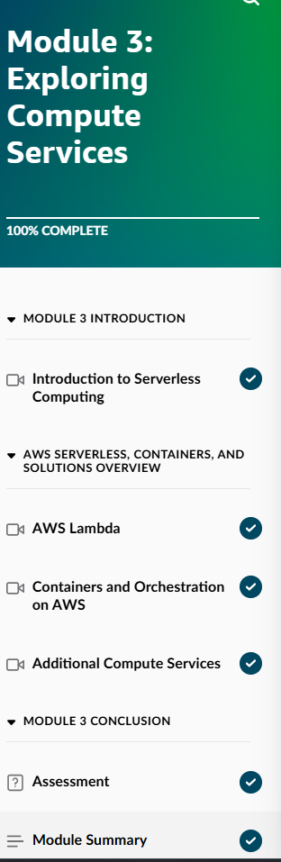
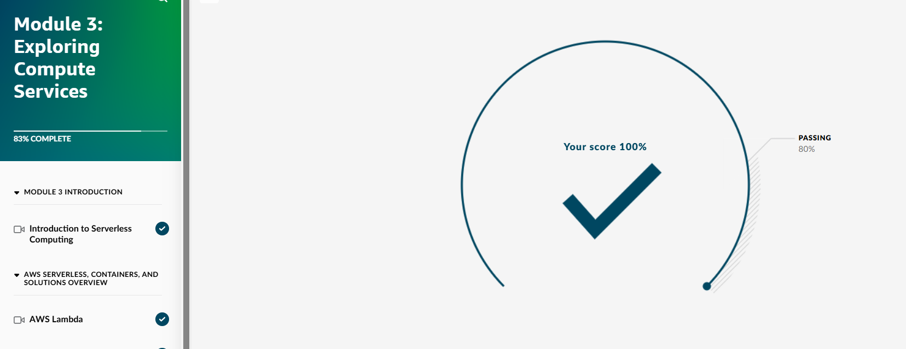
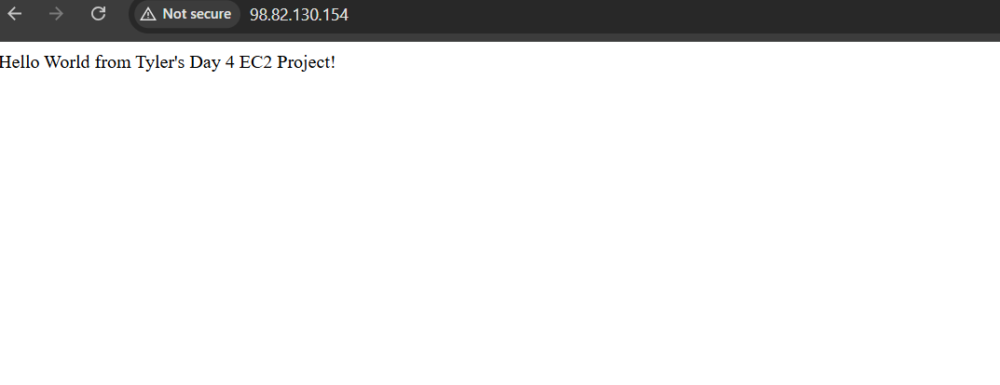

## Day 4 – EC2 Hands-On Lab & Module 3 Completion (January 16, 2026)

**Goal:** Finish Skill Builder Module 3 (Exploring Compute Services), launch/connect/terminate a real EC2 instance with a simple website

**Skill Builder Progress (Overall Course Order):**
- Module 1: Introduction to the Cloud → Completed  
- Module 2: Compute in the Cloud → Completed  
- Module 3: Exploring Compute Services → Completed (100% – introduction to serverless, Lambda, containers, additional compute services)

**What I Completed in Module 3: Exploring Compute Services**
- Introduction to Serverless Computing  
- AWS Lambda overview  
- Containers and Orchestration on AWS (ECS/EKS)  
- Additional Compute Services (overview of other options)  
- Passed final quiz/assessment with 100% score

**EC2 Hands-On Lab:**
- Launched t2.micro instance with Amazon Linux 2023 AMI  
- Created key pair (day4-key.pem)  
- Enabled public IP and HTTP security group (port 80)  
- Connected via EC2 Instance Connect (browser terminal)  
- Installed httpd web server  
- Created custom "Hello World from Tyler's Day 4 EC2 Project!" index.html page  
- Started server and tested website in browser  
- Ran `uptime` command to verify  
- Terminated instance to stay in Free Tier

**Screenshots:**
  
  
  
  
  

**Takeaways:**
- Module 3 expanded compute options: Lambda = serverless (no servers to manage), containers (ECS) for Docker apps  
- EC2 provisioning is straightforward, but security groups (port 80 for HTTP) and public IP are essential for website access  
- "It works" default page is common — fixed by overwriting index.html and restarting httpd  
- Hosting a live website on EC2 was a real milestone — first time seeing my own page on a cloud server  
- Always terminate instances — Free Tier is generous but has limits

**Next:** Day 5 – Review EC2 + start storage (S3) concepts & simple bucket project
