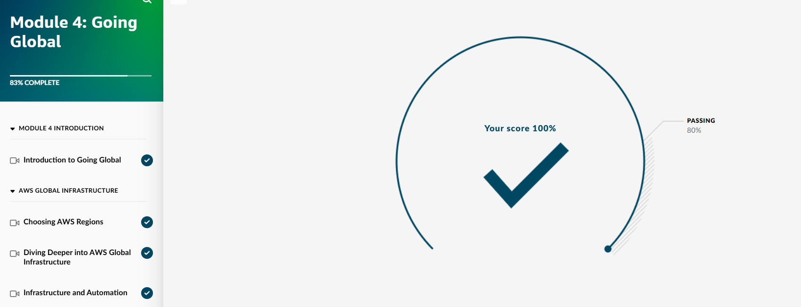
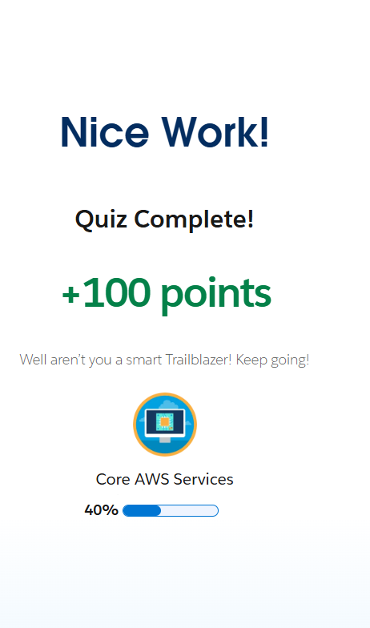

## Day 5 – Global Infrastructure & Core AWS Services (January 17, 2026)

**Goal:** Complete Skill Builder Module 4 (Going Global), continue Trailhead with AWS Well-Architected Framework and Cloud Compute exploration

**Skill Builder Progress (Overall Course Order):**
- Module 1: Introduction to the Cloud → Completed  
- Module 2: Compute in the Cloud → Completed  
- Module 3: Exploring Compute Services → Completed  
- Module 4: Going Global → Completed (100% – global infrastructure, regions, availability zones, edge locations)

**What I Completed in Module 4: Going Global**
- Introduction to Going Global  
- AWS Global Infrastructure  
- Choosing AWS Regions  
- Diving Deeper into AWS Global Infrastructure  
- Infrastructure and Automation  
- Passed final quiz/assessment with 100% score

**Trailhead Progress:**
- Completed "Learn About the AWS Well-Architected Framework" unit (best practices for building reliable, secure, efficient systems)  
- Completed "Explore Cloud Compute with AWS" unit (overview of EC2, Lambda, ECS for compute services)

**Screenshots:**
  
  
  

**Takeaways:**
- Module 4: Regions = isolated locations for compliance/low latency, AZs = multiple data centers in a region for failover, edge locations = CDN for content delivery  
- Well-Architected Framework: 6 pillars (operational excellence, security, reliability, performance, cost optimization, sustainability) — guide for building robust cloud systems  
- Explore Cloud Compute: EC2 for virtual servers, Lambda for serverless, ECS for containers — each has use cases based on workload  
- Global infrastructure ensures high availability — no single point of failure

**Next:** Day 6 – Start S3 storage concepts + create simple bucket project
