## Day 6 – Networking Module 5 Completion (January 18, 2026)

**Goal:** Complete Skill Builder Module 5 (Networking), explore VPC/subnets/routing, test connectivity with EC2 instance

**Skill Builder Progress:**
- Module 5: Networking → Completed (100% – VPC, subnets, routing, security groups)

**What I Completed in Module 5: Networking**
- Introduction to Networking  
- Amazon VPC basics (virtual private cloud)  
- Subnets (public/private) and routing tables  
- Internet gateways, NAT gateways  
- Security groups and network ACLs  
- Passed final quiz/assessment with 100% score

**VPC & EC2 Test Project:**
- Explored default VPC and existing subnets  
- Confirmed route table with 0.0.0.0/0 to IGW for public access  
- Launched test EC2 in public subnet, connected via browser terminal  
- Ran `curl google.com` (confirmed internet access) and `uptime`  
- Terminated instance

**Screenshots:**
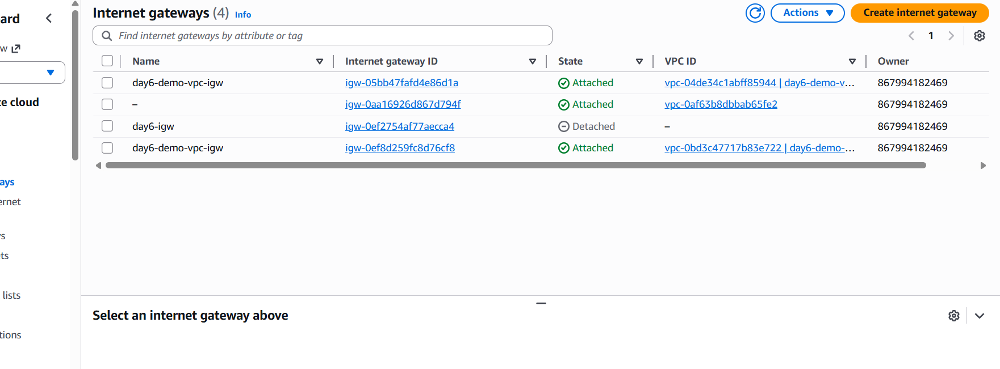  
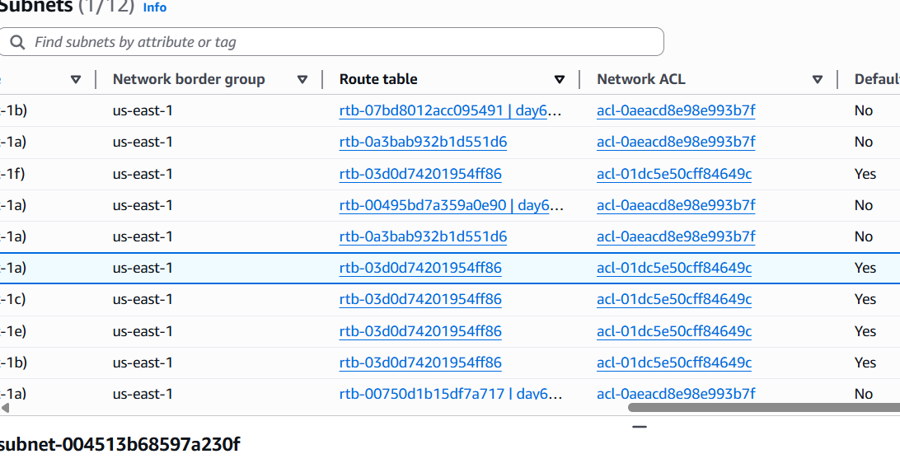  
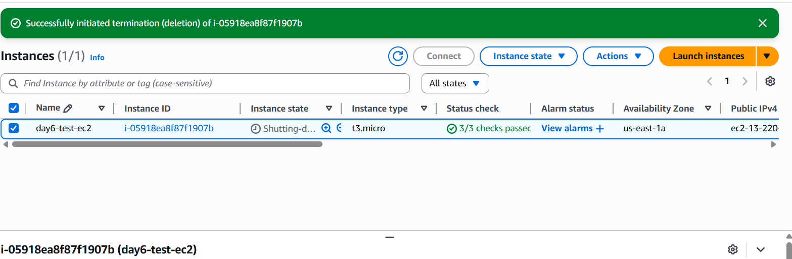  
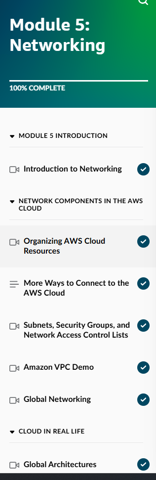  
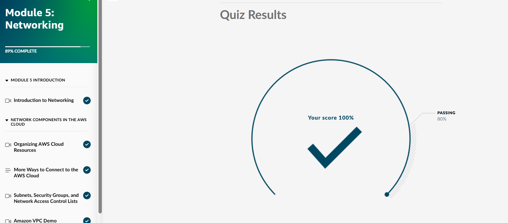  
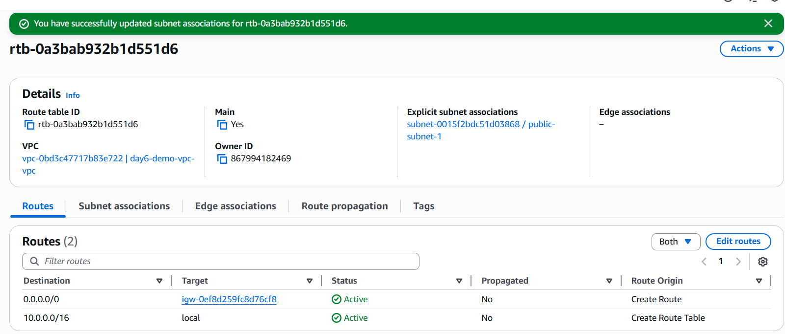  
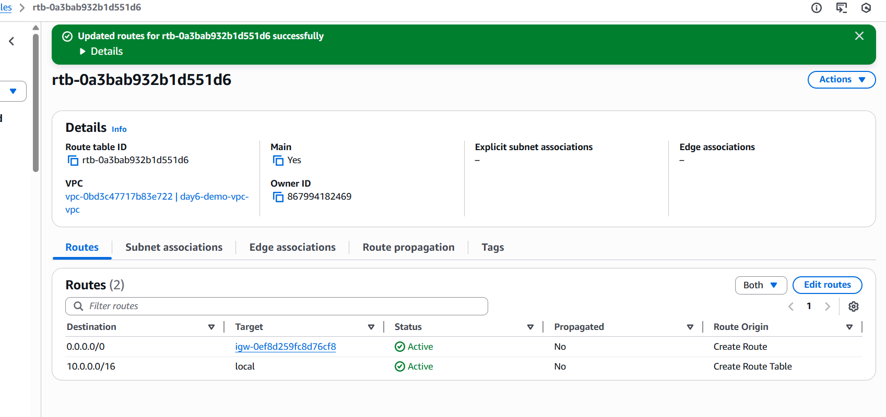  
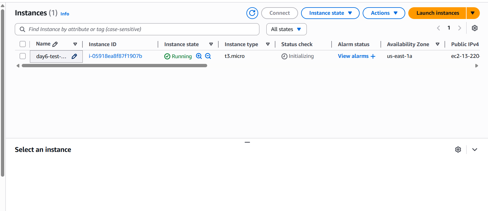  
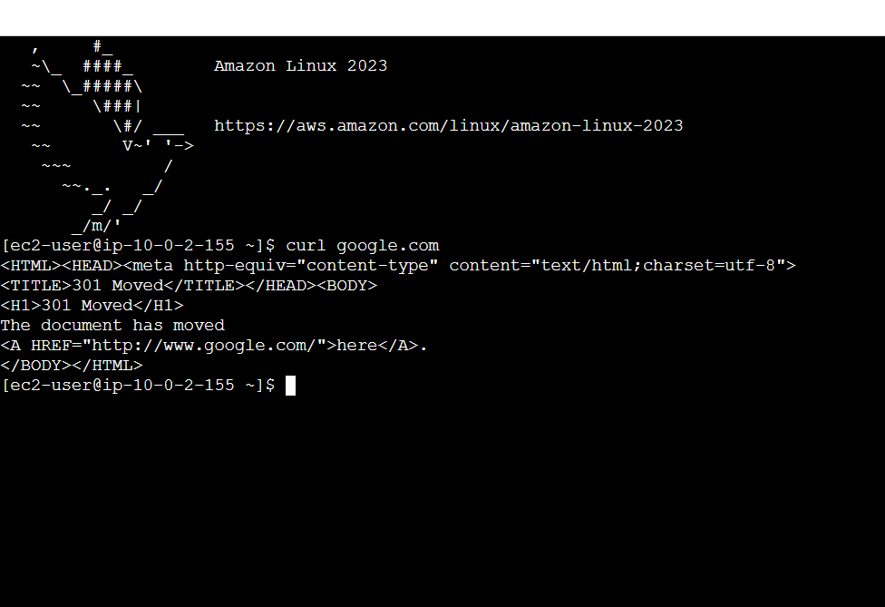  
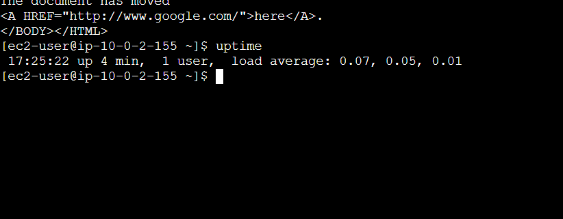  
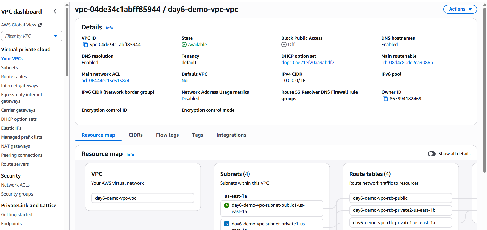  
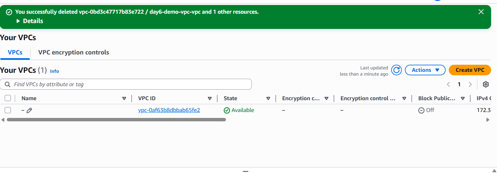  
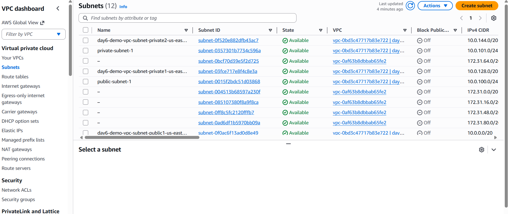

**Takeaways:**
- VPC = your private network in AWS — isolated from others  
- Public subnets = internet access (need IGW + route table), private = secure backends  
- Security groups = stateful firewalls (allow/deny traffic)  
- Networking is key for secure, scalable cloud apps — foundation for EC2, S3, databases  
- Test EC2 connectivity proved the setup works

**Next:** Day 7 – Start S3 storage concepts + simple bucket project
