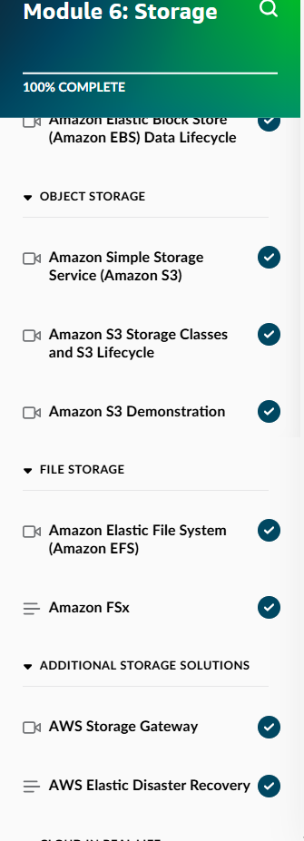
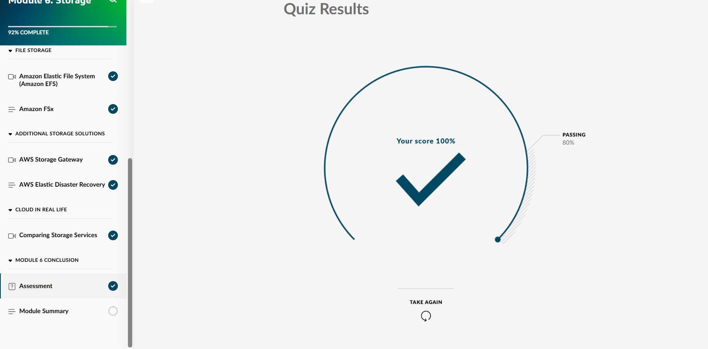
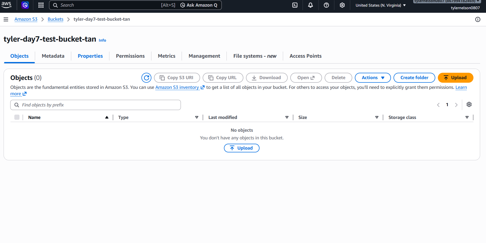
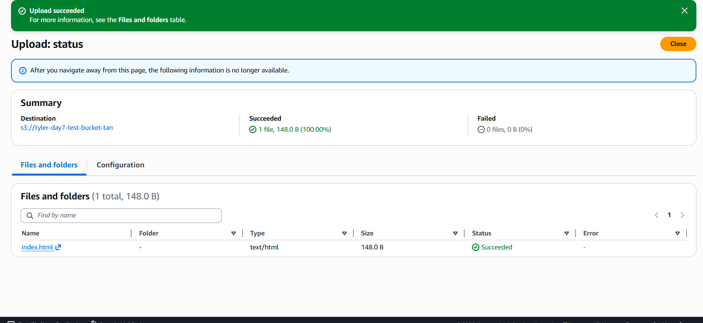
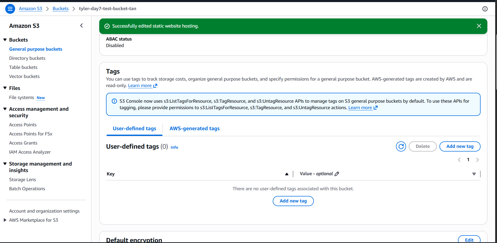
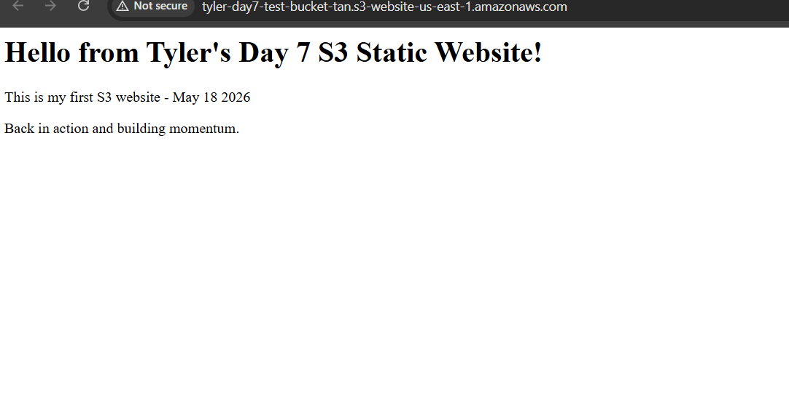
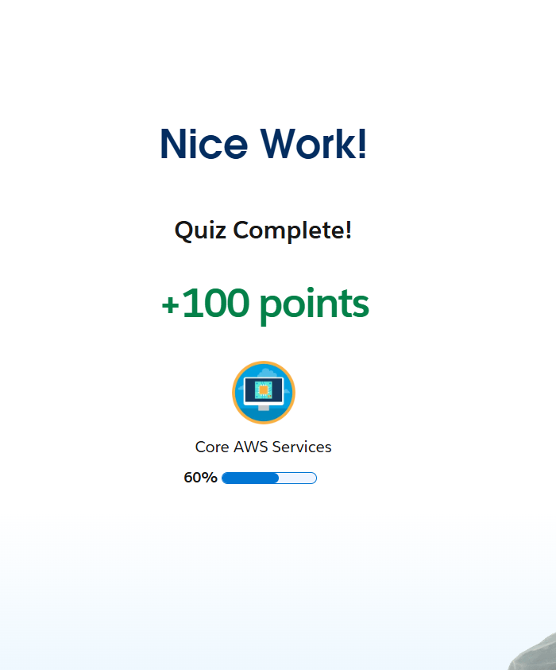

## Day 7 – Storage Module 6 & S3 Bucket Project (May 18, 2026)

**Goal:** Complete Skill Builder Module 6 (Storage), create S3 bucket, enable static website hosting, continue Trailhead

**Skill Builder Progress:**
- Module 6: Storage → Completed (S3 basics, storage classes, EBS, EFS, etc.)

**S3 Bucket Hands-On Project:**
- Created bucket and uploaded index.html
- Enabled static website hosting
- Successfully viewed live website via bucket endpoint
- Cleaned up resources

**Trailhead Progress:**
- Continued "Core AWS Services" badge

**Screenshots:**
  
  
  
  
  
  

**Takeaways:**
- S3 is highly durable and scalable object storage
- Static website hosting turns a bucket into a public website (requires index.html)
- Proper cleanup after labs keeps costs at zero in Free Tier

**Looking Ahead:**
- Excited to continue building momentum with Day 8 on Databases

**Next:** Day 8 – Databases Module (Amazon RDS, DynamoDB, etc.)

**Current Goal:** AWS Cloud Practitioner certification by mid-June
