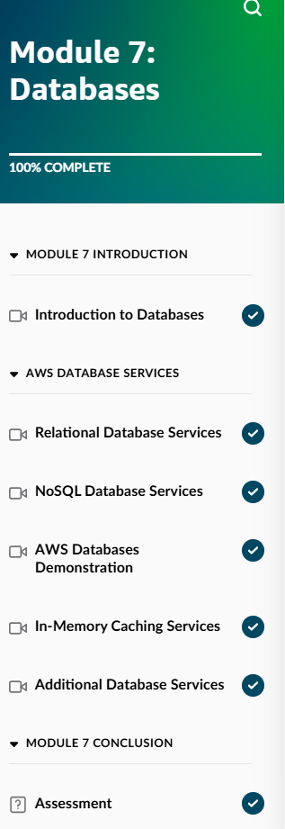
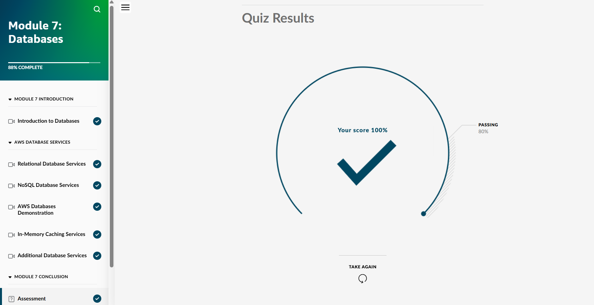
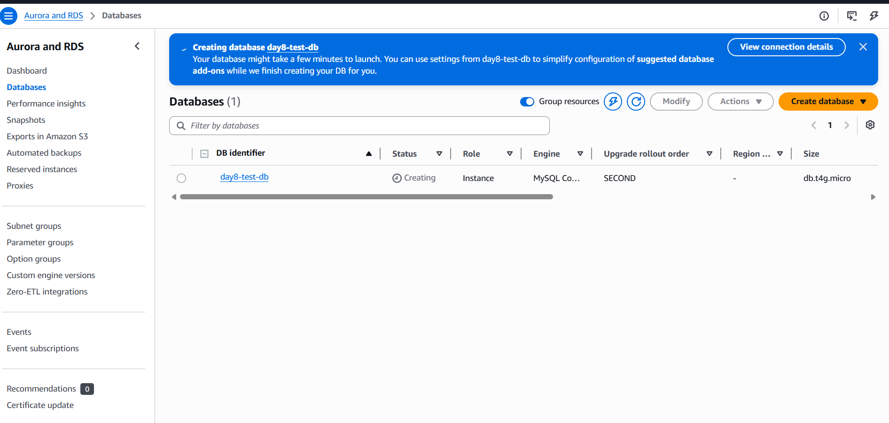
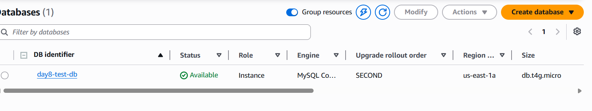
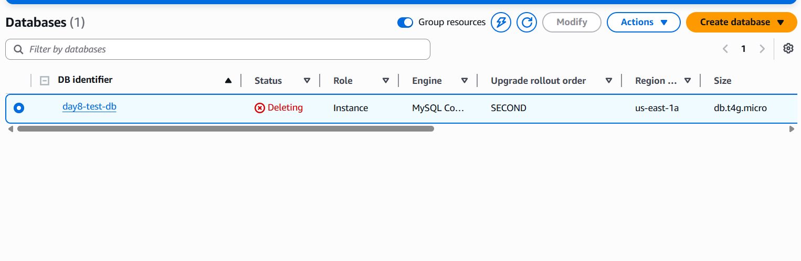
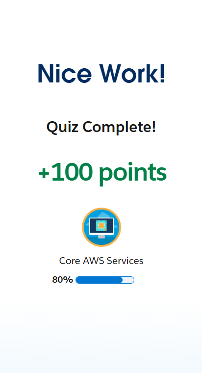

## Day 8 – Databases Module 7 & RDS Lab (May 19, 2026)

**Goal:** Complete Skill Builder Module 7 (Databases), launch a real Amazon RDS MySQL instance, continue Trailhead progress.

**Skill Builder Progress:**
- Module 7: Databases → Completed 100% (Introduction to Databases, Relational & NoSQL services, In-Memory Caching, Additional Services, Assessment)

**Hands-On RDS Lab:**
- Launched a Free Tier MySQL database (day8-test-db)
- Configured networking and security group
- Verified the instance reached Available status
- Cleaned up all resources after completion

**Trailhead Progress:**
- Continued "Core AWS Services" badge

**Screenshots:**
  
  
  
  
  

**Takeaways:**
- Amazon RDS provides fully managed relational databases with automated backups and high availability
- Proper subnet configuration across multiple Availability Zones is required for RDS
- Understanding RDS vs DynamoDB use cases is important for real-world decisions and the exam

Day 9 – Module 8 (AI/ML and Data Analytics)

**Current Goal:** AWS Cloud Practitioner certification by mid-June
