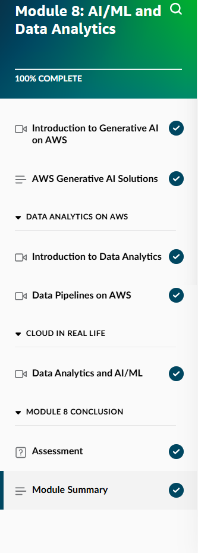
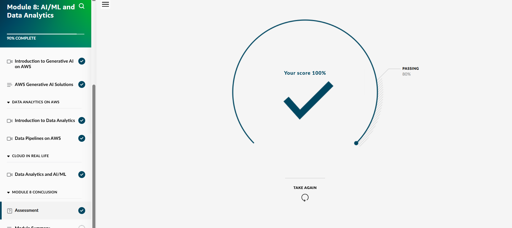
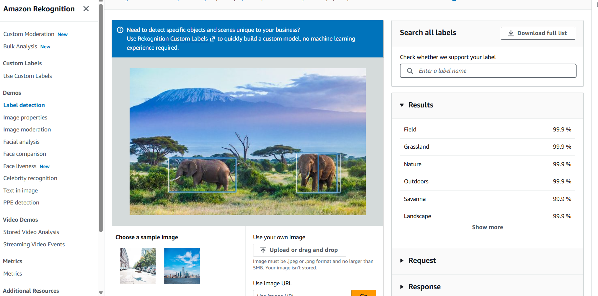
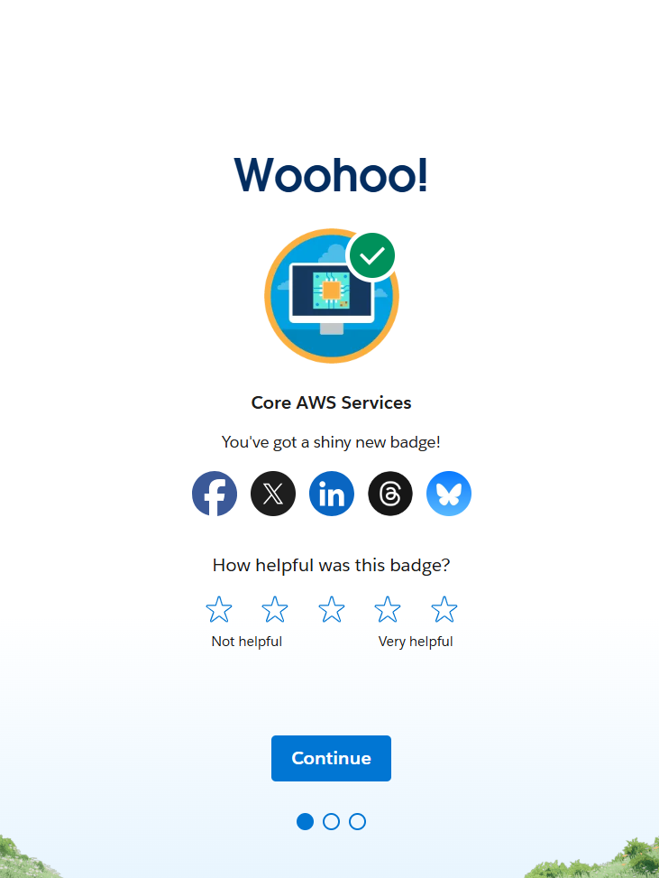

## Day 9 – Module 8: AI/ML and Data Analytics + Rekognition Lab (May 20, 2026)

**Goal:** Complete Skill Builder Module 8 (AI/ML and Data Analytics), gain hands-on experience with Amazon Rekognition, and continue Trailhead progress.

**Skill Builder Progress:**
- Module 8: AI/ML and Data Analytics → Completed 100%
- Key topics covered:
  - Fundamentals of Artificial Intelligence and Machine Learning
  - Amazon SageMaker for building, training, and deploying ML models
  - Amazon Rekognition for image and video analysis
  - Amazon Comprehend, Textract, Translate, and other AI services
  - Data Analytics services (Athena, Glue, QuickSight)
  - Responsible AI principles and real-world use cases

**Hands-On Lab: Amazon Rekognition**
- Used Rekognition’s Label Detection feature on sample images
- Successfully identified objects, scenes, and attributes with high confidence scores
- Explored practical applications such as automated tagging, content moderation, and search

**Trailhead Progress:**
- Continued "Core AWS Services" badge and earned new progress

**Screenshots:**
  
  
  

**Takeaways:**
- Amazon Rekognition makes advanced computer vision easily accessible without needing deep ML expertise
- AI/ML services can be quickly integrated into applications for automation, search, and moderation
- Understanding the capabilities and use cases of these services is increasingly valuable for cloud professionals
- Daily hands-on practice continues to strengthen technical knowledge and confidence

**Next:** Day 10 – Module 9: Security

**Current Goal:** AWS Cloud Practitioner certification by mid-June 2026
